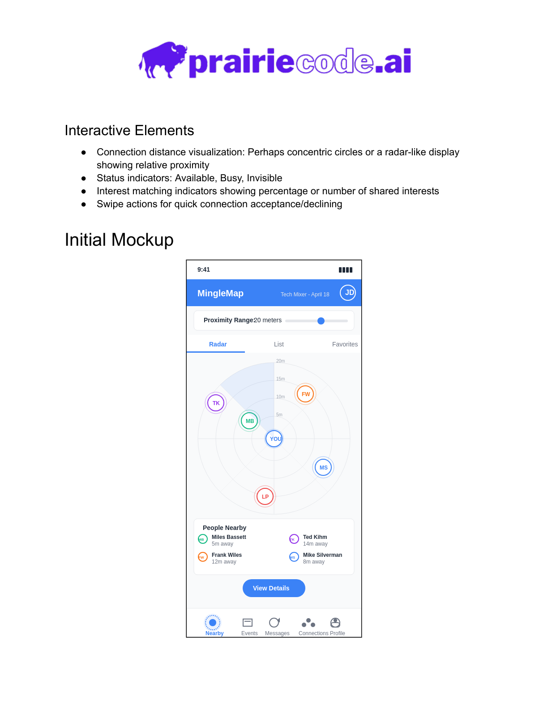

> 🍺 **Community Draft • Lawrence Tech Guild**
> First discussion: **21 May 2025 (beer meetup)**.
> Vision & maintainers will be hammered out in LTG Slack: `#minglemap`.
> Need an invite? See `COMMUNITY.md`.

# MingleMap 🚦

*A community‑driven idea for smarter in‑person networking.*

---

## Why MingleMap?



MingleMap aims to transform how tech workers in Lawrence, Kansas (and beyond) connect at social and professional events. We want to remove the awkwardness of traditional name tags and foster authentic interactions by using smart technology and thoughtful design.

---

## Current Status

**Pre‑prototype** – We are gathering community input, use cases, and design concepts. Join us in shaping the vision!

Want to help? Skip to **Contributing** below.

---

## Quick Start

Choose the setup that suits you. **Option A (Docker)** is the fastest way to get a local instance running in under five minutes. **Option B (Python virtual environment)** is still available for those who prefer a classic dev setup.

> [!NOTE]
> Assumes you run commands from the repo root and use the default SQLite settings; Docker also starts Postgres/Redis, but Django does not read `DATABASE_URL` yet.

### Prerequisites

> [!IMPORTANT]
> Install the tools needed for the path you choose (Docker Desktop/Engine, or Python 3.10+ with pip).

- **Git** – to clone the repository.
- **Docker Desktop** (Windows 11/macOS) or **Docker Engine 20.10+** with the **Compose plugin** (Linux) for the Docker setup.
- **Python 3.10+** and **pip** for the virtual environment setup.
- **Node.js 18+** and **npm** only if you plan to run the frontend.

Ubuntu 22.04 setup for Docker:

```bash
sudo apt-get update
sudo apt-get install docker.io docker-compose-plugin
sudo usermod -aG docker $USER   # log out & back in
```

### Setup

#### Option A – Docker (recommended)

```bash
# 1 – Clone the repo
git clone https://github.com/Lawrence-Tech-Guild/minglemap.git
cd minglemap

# 2 – Build and start the stack (first run takes ±2 min)
docker compose up -d   # -d = detached; skip it if you want to watch logs

# 3 – Tail logs (optional)
docker compose logs -f web
```

Open http://localhost:8000/api/ once the web container is healthy.

> [!CAUTION]
> `docker compose down -v` removes database and Redis volumes and deletes local data.

```bash
docker compose down
# docker compose down -v
```

**Live reload** – Source code is bind‑mounted, so any change you make on the host triggers Django’s auto‑reload in the running container.

#### Option B – Python virtual environment (advanced)

```bash
# 1 – Clone the repo
git clone https://github.com/Lawrence-Tech-Guild/minglemap.git
cd minglemap

# 2 – Create & activate a virtual environment
python3 -m venv .venv
source .venv/bin/activate       # Windows: .venv\Scripts\activate

# 3 – Install package in editable mode with dev tools
pip install -e .[dev]

# 4 – Apply migrations and run the Django dev server
python manage.py migrate
python manage.py runserver
```

Use `python manage.py ...` for Django commands; the `minglemap` console script is a stub.

#### Frontend (optional)

```bash
cd frontend
npm install
npm run dev
```

### Verification

#### Docker

```bash
docker compose ps
docker compose exec web python manage.py check
curl -I http://localhost:8000/api/
```

Expect the web container to be healthy and the API route to return a 200.

#### Python virtual environment

```bash
python manage.py check
pytest
```

With `python manage.py runserver` running, visit http://localhost:8000/api/ and confirm you see the API root.

### Troubleshooting

- `docker compose` cannot connect to the daemon: start Docker Desktop or run `sudo systemctl start docker` (Linux).
- Port 8000 is already in use: stop the other process or run `python manage.py runserver 8001` and browse http://localhost:8001/api/.
- `ModuleNotFoundError: django` or `pytest: command not found`: activate the venv and run `pip install -e .[dev]`.
- Frontend fails to start: confirm Node 18+ with `node -v`, then reinstall dependencies with `npm install`.

## Developing in VS Code Dev Containers

1. Install Docker Desktop and VS Code with the Dev Containers and Docker extensions.
2. Open the repo in VS Code, then run “Dev Containers: Reopen in Container”.
3. Backend will be available at http://localhost:8000.
4. If the `frontend` directory exists, the Vite dev server will be at http://localhost:5173 (either started via the override or manually with `cd frontend && npm install && npm run dev` inside the container).

> [!CAUTION]
> `docker compose down -v` removes database and Redis volumes and deletes local data.

Useful commands: `docker compose up -d`, `docker compose logs -f`, `docker compose down -v`.

---

## About Lawrence Tech Guild

MingleMap is a collaborative exploration inspired by **Lawrence Tech Guild**, a grassroots organisation that brings tech workers together for networking and community‑building events in Lawrence, Kansas.

* Share local or remote job opportunities.
* Plan meetups and tech‑oriented social events.
* Connect with experts for advice and collaboration.

> **Connect. Make friends. Come to Tech Guild.**

Interested? Ask a Tech Guild admin to join the Slack workspace or mailing list, and let’s keep growing a useful, engaging tech community!

---

## Contributing

We warmly welcome both seasoned developers and first‑time open‑source contributors.

* Check out the [`docs/`](./docs/) directory for current ideas and designs.
* Pick an issue tagged **good first issue** to get started.
* Join the conversation in GitHub Issues or the Lawrence Tech Guild Slack.

Let’s make networking smarter – together!
